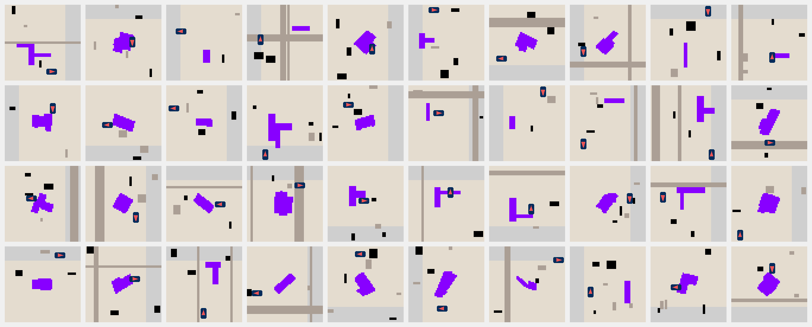

# 🌍 Terra - Earthwork planning environment in JAX



Terra is a flexible and abstracted grid world environment for training intelligent agents in the context of earthworks planning. It makes it possible to approach motion and excavation high-level planning as a reinforcement learning problem, providing a multi-GPU JAX-accelerated environment. We show that we can train an agent capable of planning earthworks in trenches and foundations environments in less than 1 minute on 8 Nvidia RTX-4090 GPUs.

## Features
- 🚜 Agents: Wheeled and tracked excavator embodiments for different types of actions
- 🏞️ Maps: Up to 3 axes trenches and real-world building foundations as target maps
- 🔥 Performance: Easily scale to more than 1M steps per second on a single GPU
- 🚀 Scaling: Out of the box multi-device training using
- 📖 Curriculum: Customizable out of the box RL curriculum
- 🔧 Tooling: Visualization, evaluation, and play scripts
- 🏌 Baselines: We provide baseline results and PPO-based training scripts inspired from PureJaxRL and xland-minigrid

## Installation
Clone the repo, and if you want to use Terra in your project use 
~~~
pip install -e .
~~~
You can check out [terra-baselines](https://github.com/leggedrobotics/rl-excavation-planning) for an installation workflow example.

### JAX
The JAX installation is hardware-dependent and therefore needs to be done separately. Follow [this link](https://jax.readthedocs.io/en/latest/installation.html) to install the right one for you.

## Usage
The standard workflow is made of the following steps:
1. Generate the maps with `python -m generate_maps.py` (you can check out a preview of the generated maps in the `data/` folder)
2. Set up the curriculum in `config.py`
2. Build your own training script or use the ready-to-use script from our [terra-baselines](https://github.com/leggedrobotics/rl-excavation-planning).
3. Train 🚀
4. Run [evaluations](https://github.com/leggedrobotics/rl-excavation-planning/blob/master/eval.py) and [visualization](https://github.com/leggedrobotics/rl-excavation-planning/blob/master/visualize.py).

### Basic Usage
``` python
import jax
from terra.env import TerraEnvBatch
from terra.config import EnvConfig

key = jax.random.PRNGKey(0)
key, reset_key, step_key = jax.random.split(key, 3)

# create Terra and configs
env = TerraEnvBatch()
env_params = EnvConfig()

# jitted reset and step functions
timestep = env.reset(env_params, reset_key)
timestep = env.step(timestep, action, step_key)
```

### Map generation
Running the standard map generation will produce the following folder structure. This includes foundations and trenches, and additional curriculum maps that help with the training in case the sparse reward strategy is used.
```
- data
    - generated_squares  <-- maps for curriculum early levels
    - trenches  <-- trenches with 1 to 3 intersecting axes 
    - foundations  <-- building foundations from OpenStreetMap
        - 16x16
        - 32x32
        - 64x64
            - dumpability  <-- encodes where the agent can dump
            - images  <-- encodes the target dig profile
            - occupancy  <-- encodes the obstacles
```

### Training Configurations
In Terra the settings are expressed as curriculum levels. To set the levels of the training, you can edit the `config.py` file. For example, if you want to start your training with dense rewards on foundations and then shift to shorter episodes with sparse rewards, you can set the curriculum as follows.
``` python
class CurriculumGlobalConfig(NamedTuple):
    increase_level_threshold: int = 3
    decrease_level_threshold: int = 10
    
    levels = [
        {
            "maps_path": "foundations_20_50",
            "max_steps_in_episode": 300,
            "rewards_type": RewardsType.DENSE,
            "apply_trench_rewards": False,
        },
        {
            "maps_path": "foundations_20_50",
            "max_steps_in_episode": 200,
            "rewards_type": RewardsType.SPARSE,
            "apply_trench_rewards": False,
        }
    ]
```
Note that `apply_trench_rewards` should be `True` if you are training on trenches. This enables an additional reward that penalizes the distance of the agent from any trench axis at dig time, pushing the agent to be aligned to them.

To select the embodiment to use, set the following to either `TrackedAction` or `WheeledAction`. Check out `state.py` for the documentation of the embodiment-specific state transitions.
``` python
class BatchConfig(NamedTuple):
    action_type: Action = TrackedAction
```

## Tools 🔧
We provide debugging tools to explore Terra maps and play with the different agents.

You can play on a single environment using your keyboard with
``` python
python -m terra.viz.main_manual
```
and you can inspect the generated maps with
``` python
python -m terra.viz.play
```
note that these scripts assume that the maps are stored in the `data/` folder.

## Rules 🔮
In Terra the agent can move around, dig, and dump terrain. The target map defines all the tiles that can be dug, and the action map stores the progress. Tiles are dug in batches, where a batch is defined by the conical section representing the full reach of the excavator arm for a given base and cabin pose. Therefore, with a `DO` action, the agent digs all the tiles in the target map that are within reach, and subsequently with another `DO` action it distributes the dirt evenly on the dumpable tiles within reach. The maps also have obstacles (tiles where the agent cannot traverse) and a dumpability mask (tiles where the agent needs to deposit all the dirt to complete the task). Check out `map.py` for the documentation of the map layering and logic.

## Performance 🔥
TODO scaling graph

## Baselines 🎮
We release a set of baselines and checkpoints in [terra-baselines](https://github.com/leggedrobotics/rl-excavation-planning).

## Citation
```
Coming soon...
```