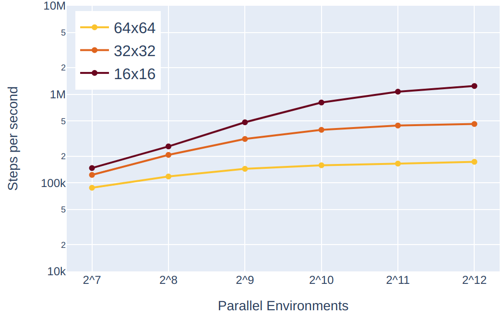
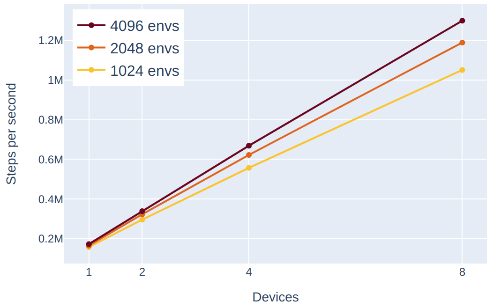

# 🌍 Terra - Earthwork planning environment in JAX


Terra is a flexible and abstracted grid world environment for training intelligent agents in the context of earthworks planning. It makes it possible to approach motion and excavation high-level planning as a reinforcement learning problem, providing a multi-GPU JAX-accelerated environment. We show that we can train an agent capable of planning earthworks in trenches and foundations environments in less than 1 minute on 8 Nvidia RTX-4090 GPUs.

## Features
- 🚜 Two Agent Types: Wheeled and tracked excavator embodiments for different types of actions
- 🏞️ Realistic Maps: Up-to-3-axes trenches and building foundations with obstacles and dumping constraints
- 🔥 Performance: Easily scale to more than 1M steps per second on a single GPU
- 🚀 Scaling: Out of the box multi-device training
- 📖 Curriculum: Customizable RL curriculum via config interface
- 🔧 Tooling: Visualization, evaluation, manual play, and maps inspection scripts
- 🏌 Baselines: We provide baseline results and PPO-based training scripts inspired from [purejaxrl](https://github.com/luchris429/purejaxrl) and [xland-minigrid](https://github.com/corl-team/xland-minigrid)

## Installation
Clone the repo, and if you want to use Terra in your project use 
~~~
pip install -e .
~~~
You can check out [terra-baselines](https://github.com/leggedrobotics/rl-excavation-planning) for an installation workflow example.

### JAX
The JAX installation is hardware-dependent and therefore needs to be done separately. Follow [this link](https://jax.readthedocs.io/en/latest/installation.html) to install the right one for you.

## Usage
The standard workflow is made of the following steps:
1. Generate the maps by following this [README](https://github.com/leggedrobotics/terra/blob/main/terra/env_generation/README.md) (you can check out a preview of the generated maps in the `data/` folder)
2. Set up the curriculum in `config.py`
2. Build your own training script or use the ready-to-use script from our [terra-baselines](https://github.com/leggedrobotics/rl-excavation-planning).
3. Train 🚀
4. Run [evaluations](https://github.com/leggedrobotics/rl-excavation-planning/blob/master/eval.py) and [visualization](https://github.com/leggedrobotics/rl-excavation-planning/blob/master/visualize.py).

# Environment Setup Instructions

This repository includes configuration files to help you set up the required environment for this project.

## Using Conda Environment (Recommended)

The `environment.yml` file contains all the necessary dependencies to reproduce the project environment named "terra" with Python 3.12.2.

### Creating the Environment

To create a new conda environment from the provided `environment.yml` file, run:

```bash
conda env create -f environment.yml
```

This command will create a new environment named "terra" with all the specified dependencies.

### Activating the Environment

After creating the environment, activate it with:

```bash
conda activate terra
```

### Installing Terra and JAX

After activating the environment it is necessary to install Terra

```bash
pip install -e .
```

and [JAX](https://docs.jax.dev/en/latest/installation.html).

At the moment you should use jaxlib and jax version <= 0.4.26 as `jax.tree_map` is deprecated in newer versions

```bash
pip install -U "jax[cuda12]==0.4.26" jaxlib==0.4.26+cuda12.cudnn89 -f https://storage.googleapis.com/jax-releases/jax_cuda_releases.html
```

With GPU (NVIDIA, CUDA 12):

```bash
pip install -U "jax[cuda12]"
```

### Verifying the Environment

To verify that the environment was set up correctly, you can:

1. Check that you're in the correct environment:
   ```bash
   conda info
   ```
   The active environment should be displayed as "terra".

2. List all installed packages:
   ```bash
   conda list
   ```

3. Check Python version:
   ```bash
   python --version
   ```
   This should output "Python 3.12.2"

## Environment Files: requirements.txt vs environment.yml

### environment.yml

The `environment.yml` file is used by conda to create environments and has several advantages:
- Specifies the Python version
- Can include conda and pip dependencies in one file
- Can include dependencies from multiple channels
- Resolves dependencies more effectively than pip alone
- Handles non-Python dependencies (e.g., C libraries)

### requirements.txt

The `requirements.txt` file is a standard pip requirements file that specifies Python packages to be installed with pip. This file:
- Lists Python dependencies only
- Can be used with `pip install -r requirements.txt`
- Doesn't specify Python version
- Doesn't handle non-Python dependencies

For this project, the `environment.yml` file is the recommended way to set up your environment as it ensures all dependencies (including the correct Python version) are properly installed.

## Updating the Environment

If you need to update the environment after changes to the `environment.yml` file:

```bash
conda env update -f environment.yml --prune
```

The `--prune` option removes dependencies that are no longer specified in the updated file.


### Basic Usage
``` python
import jax
from terra.env import TerraEnvBatch
from terra.config import EnvConfig

key = jax.random.PRNGKey(0)
key, reset_key, step_key = jax.random.split(key, 3)

# create Terra and configs
env = TerraEnvBatch()
env_params = EnvConfig()

# jitted reset and step functions
timestep = env.reset(env_params, reset_key)
timestep = env.step(timestep, action, step_key)
```

### Map generation
Running the standard map generation will produce the following folder structure. This includes foundations and trenches, and additional curriculum maps that help with the training in case the sparse reward strategy is used.
```
- data
    - openstreet
    - terra
        - foundations
        - trenches 
        - train  <- npy maps formatter for terra
            - squares  <-- maps for curriculum early levels
            - trenches  <-- trenches with 1 to 3 intersecting axes 
            - foundations  <-- building foundations from OpenStreetMap
                - dumpability  <-- encodes where the agent can dump
                - images  <-- encodes the target dig profile
                - occupancy  <-- encodes the obstacles
```

### Training Configurations
In Terra the settings are expressed as curriculum levels. To set the levels of the training, you can edit the `config.py` file. For example, if you want to start your training with dense rewards on foundations and then shift to shorter episodes with sparse rewards, you can set the curriculum as follows.
``` python
class CurriculumGlobalConfig(NamedTuple):
    increase_level_threshold: int = 3
    decrease_level_threshold: int = 10
    
    levels = [
        {
            "maps_path": "foundations_20_50",
            "max_steps_in_episode": 300,
            "rewards_type": RewardsType.DENSE,
            "apply_trench_rewards": False,
        },
        {
            "maps_path": "foundations_20_50",
            "max_steps_in_episode": 200,
            "rewards_type": RewardsType.SPARSE,
            "apply_trench_rewards": False,
        }
    ]
```
Note that `apply_trench_rewards` should be `True` if you are training on trenches. This enables an additional reward that penalizes the distance of the agent from any trench axis at dig time, pushing the agent to be aligned to them.

To select the embodiment to use, set the following to either `TrackedAction` or `WheeledAction`. Check out `state.py` for the documentation of the embodiment-specific state transitions.
``` python
class BatchConfig(NamedTuple):
    action_type: Action = TrackedAction
```

## Tools 🔧
We provide debugging tools to explore Terra maps and play with the different agents.

You can play on a single environment using your keyboard with
``` python
DATASET_PATH=/path/to/dataset DATASET_SIZE=<num_maps_per_type> python -m terra.viz.main_manual
```
and you can inspect the generated maps with
``` python
DATASET_PATH=/path/to/dataset DATASET_SIZE=<num_maps_per_type> python -m terra.viz.play
```
note that these scripts assume that the maps are stored in the `data/` folder.

## Rules 🔮
In Terra the agent can move around, dig, and dump terrain. The goal of the agent is to dig the target shape given at the beginning of the episode, planning around obstacles and dumping constraints. The target map defines all the tiles that can be dug, and the action map stores the progress. Tiles are dug in batches, where a batch is defined by the conical section representing the full reach of the excavator arm for a given base and cabin pose. Therefore, with a `DO` action, the agent digs all the tiles in the target map that are within reach, and subsequently with another `DO` action it distributes the dirt evenly on the dumpable tiles within reach.

### Agent Types
Two types of excavators are abstracted in Terra: tracked and wheeled. The difference is that the tracked excavator is able to turn the base on the spot whereas the wheeled turns by doing an L-shaped movement (e.g. forward-turn-forward).

### Map Types
Terra comes with two types of maps: foundations and trenches. Foundations are produced by projecting real building profiles from OpenStreetMap on the grid map. Trenches are procedurally generated and are divided in three categories based on the number of axes the trench has (1 to 3). All the maps have additional layers to encode obstacles, regions where the excavator can't dump terrain (e.g. roads), and regions where the excavator needs to dump all the terrain to terminate the episode (terminal dumping areas). Check out `map.py` for the documentation of the map layering and logic. 

## Observation Space 🔍
The agent in Terra perceives the environment through a rich observation space that provides comprehensive information about the state of the world and the agent itself. The observation is a dictionary with the following components:

- **agent_states**: A 6-dimensional vector containing:
  - Position of the base (x, y coordinates)
  - Base rotation angle
  - Cabin rotation angle
  - Whether the agent is loaded with dirt (0 or 1)
  - Wheel angle (in case of wheeled digger)

- **Local Maps**: The agent has access to local maps representing different aspects of the environment from the agent's perspective:
  - **local_map_action_neg/pos**: Current state of the terrain (negative/positive height) within the agent's reach
  - **local_map_target_neg/pos**: Target digging profile (negative/positive height) within reach
  - **local_map_dumpability**: Areas where the agent can dump soil within reach
  - **local_map_obstacles**: Obstacles within the agent's reach

- **Global Maps**: Full maps of the environment:
  - **action_map**: Current state of the terrain across the entire map
  - **target_map**: Target digging profile across the entire map
  - **traversability_mask**: Areas where the agent can navigate
  - **dig_map**: Preview of the dig/dump action result if executed
  - **dumpability_mask**: Areas where the agent can dump soil
  - **padding_mask**: Areas with obstacles

- **Agent Dimensions**:
  - **agent_width**: Width of the agent
  - **agent_height**: Height of the agent

This rich observation space allows the agent to understand both its immediate surroundings and the global state of the environment, enabling effective planning for navigation, digging, and dumping operations.

## Performance 🔥
We benchmark the environments by measuring the runtime of our PPO algorithm including environment steps and model update on Nvidia RTX-4090 GPUs. For all the experiments we keep constant 32 steps, 32 minibatches, and 1 update epoch.

Scaling on single device             |  Scaling across devices
:-------------------------:|:-------------------------:
  |  

## Baselines 🎮
We release a set of baselines and checkpoints in [terra-baselines](https://github.com/leggedrobotics/rl-excavation-planning).

## Citation
If you use this code in your research or project, please cite the following:
```
@misc{terra,
    title={Terra - Earthwork planning environment in JAX},
    author={Antonio Arbues, Lorenzo Terenzi},
    howpublished={\url{https://github.com/leggedrobotics/terra}},
    year={2024}
}
```
