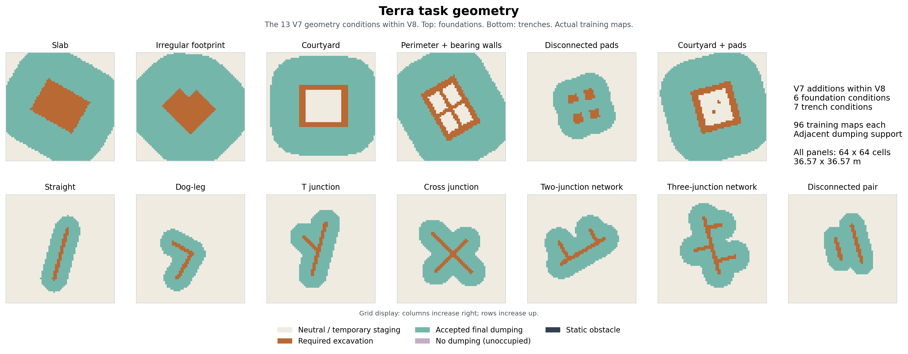
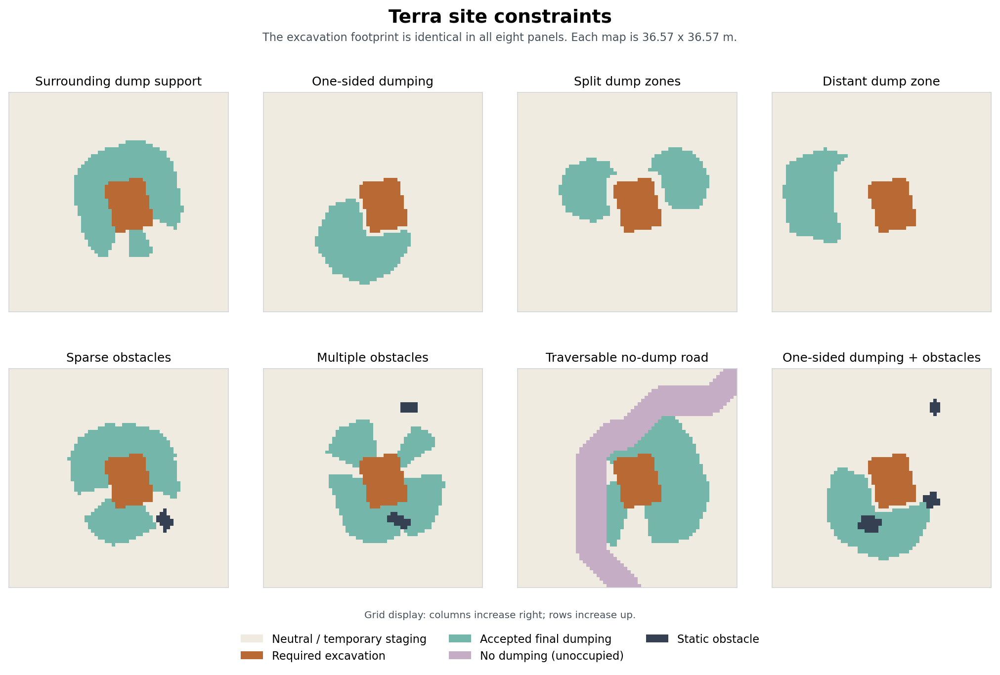
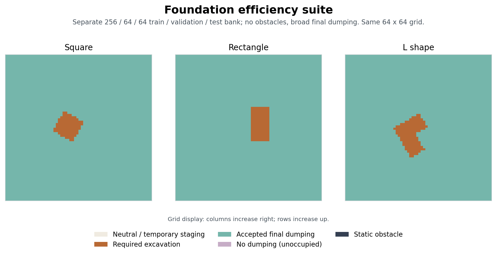

# Terra dataset reference

Audited on **2026-09-08** from local manifests, reset arrays and generator
sources. This document describes the datasets used by the mixed V8 studies and
the later foundation and trench studies. Experiment names are not dataset
versions. The [training ledger](https://github.com/leggedrobotics/terra-baselines/blob/main/docs/EXPERIMENTS_RUNNING.md)
identifies which bank and environment revision each experiment used.

Source links identify public code where available. References marked **local**
are paths relative to the original `/home/lorenzo/moleworks` workspace. Input
banks and unpublished experiment snapshots are separate from this documentation.
The September optional behaviors describe those recorded snapshots and may not
be implemented in the published main branch.

## Dataset scope

Terra tasks are **excavation layouts on a grid**. The terrain families below
describe the horizontal shape of the requested excavation, together with spoil
placement and site constraints. They are not soil classes, geological strata,
or measured rough-terrain datasets. The audited ordinary maps start flat:
`action_map` is zero and target excavation depth is one discrete height unit.
Terrain changes as the agent excavates and deposits material.

| Dataset or view | Training slots | Conditions or shape families | Evaluation support | Role |
|---|---:|---|---|---|
| Mixed V8, R2 distance materialization | 4,512 | 47 conditions: 25 foundation, 22 trench | Main: 720 promotion, 720 development, 1,440 sealed; capability controls: 32, 32, 64 | Mixed geometry and constraint studies |
| V8 with finite trench metadata, full bank | 4,512 | Same 47 conditions and physical maps | Same original panels plus a filtered `gate_main` view | Metadata enrichment; seven V7 trench conditions lack the finite records required by the alignment gate |
| V2 pooled generalist | 3,840 | 40 conditions: 25 foundation, 15 trench | `gate_main`: 608 promotion, 608 development, 1,216 sealed; controls separate | September generalist training before the foundation adaptation study |
| V2 pooled trench specialist | 1,440 | 15 trench conditions | Trench subset of `gate_main`: 224, 224, 448; straight all-free control separate | Current trench specialist bank |
| Easy foundation study, September 7 | 256 | Square, rectangle, L | 64 validation and 64 test | Current foundation reward and behavior study |

Counts in this table are **slots**, not independent source geometries. V8 has
three duplicate reset-array pairs in its straight all-free training control;
the mixed bank therefore contains 4,509 distinct stored training-map scenarios.
The generalist and trench pools contain 3,837 and 1,437 distinct stored scenarios
respectively. Random initial agent poses are not counted in these totals. The
[identity audit below](#identity-and-split-audit) records the distinction.

The current foundation study and trench specialist use different banks. Neither
their results nor their counts should be presented as a single all-V8 result.
The older 37-condition generalist and 12-condition trench pilot excluded
`net4` as well as the seven V7 trench geometries. Those views are historical;
the 40/15 views include `net4` under the later environment semantics.

The figures below use actual training-map arrays, with representative selection
and slot identities recorded in
[`figure_samples.csv`](assets/dataset/figure_samples.csv). Geometry and
constraint figures use the finite-enriched V8 bank. Matched foundation
constraint panels share the same excavation raster. These illustrations use
training data only and do not consume validation or sealed episodes. A
[complete 47-condition atlas](assets/dataset/all_conditions.svg) is available
alongside the focused figures.

## Grid layers and units

All banks in the table use **64 × 64 cells**, with side length
36.5714285714 m and cell spacing 0.571428571428125 m. A cell covers approximately
0.3265 m². Heights and material amounts use discrete grid units; the dataset
does not specify a conversion of one height unit into metres. Report excavation
area in m² or material in cell-height units unless the experiment explicitly
defines a vertical scale. A target value of `-1` alone does not establish a
one-metre excavation depth.

Each map directory contains aligned NumPy arrays with numeric slot names:

| File | Meaning |
|---|---|
| `images/img_N.npy` | Target: `-1` required excavation, `0` neutral ground, `+1` accepted final spoil region |
| `actions/img_N.npy` | Initial terrain state: negative excavated height, positive loose soil; zero on ordinary full-task resets |
| `occupancy/img_N.npy` | Static obstacle mask; true cells obstruct machine motion and material placement |
| `dumpability/img_N.npy` | Static legal-placement mask; false cells prohibit dumping even when they are traversable |
| `distance/img_N.npy` | Distance potential to accepted final spoil support under the named distance protocol |
| `metadata/trench_N.json` | Geometry-specific axes, optional finite trench sections, foundation edges and lineage |
| `manifest.jsonl` | Slot, map, scenario, source-group and split identities; evaluation rows also carry reset seeds |

These layers encode three different forms of restriction:

1. **Static obstacle:** `occupancy=true`; a physical exclusion footprint in the
   planning abstraction.
2. **No dumping:** `dumpability=false`; ground that must stay clear of spoil,
   including the protected road corridors.
3. **Not accepted at completion:** `target=0`; it may still permit temporary
   staging when dumpability and the transition rules allow it. Material placed
   there must be removed before exact completion.

The positive target is an accepted **region**, not a demand to raise every
positive cell to height one. Its area gives a useful single-layer storage
ratio, `accepted_cells / required_dig_cells`. This ratio does not prove usable
workspace capacity, machine access, or completion within the episode horizon.
Static legal placement is also subject to dynamic reach, current terrain and
material-placement rules.

R2 uses `obstacle_geodesic_8_physical_global_v1`: shortest grid distance to
accepted spoil cells, with cardinal cost 1 and diagonal cost √2, multiplied by
cell spacing and divided by a **16 m global reference**. The admitted normalized
bound is 2.5; there is no per-map normalization or clipping. Only static
occupancy blocks this distance computation. It is a material-distance potential,
not an excavator route or a footprint-aware path length. Protected roads remain
traversable in this calculation. The implementation is
[`compute_reward_v2_distance_map`](https://github.com/leggedrobotics/terra/blob/25f855db3d913fd638c4e56b1740437a2b7122ca/terra/env_generation/distance.py).

For plots use column as horizontal x and row as vertical y, and label which way
y increases. Finite-section metadata explicitly uses `[row, column]` (`yx`).
Do not infer a physical axis convention from the array display defaults.

## Foundation geometries



[Vector geometry figure](assets/dataset/terrain_geometry.svg).

Foundations represent broad building excavations or footing layouts. The names
describe target geometry; they do not imply a structural design or an existing
building obstacle.

| Geometry | What the target contains | Mixed V8 condition IDs |
|---|---|---|
| Source-bank slab | A compact, connected footprint derived from the older foundation source pool | `fnd-slab-*` |
| Large source-bank slab | A larger rescaled footprint | `fnd-slab-lg-ring3x` |
| Procedural footprint | A connected union of a main rectangle and smaller wings | `fnd-proc-ring3x`, `fnd-proc-side1-road` |
| Structural strips and pads | Several excavation strips/pads; the 96 training maps have 2–6 four-connected components | `fnd-strips-ring3x` |
| V7 slab | A rotated rectangular excavation | `v7-fnd-slab-adjacent` |
| V7 irregular | A coherent L- or T-shaped footprint, with no enclosed hole | `v7-fnd-irregular-adjacent` |
| V7 courtyard | Excavation around a neutral interior | `v7-fnd-courtyard-adjacent` |
| V7 bearing walls | Perimeter excavation plus two intersecting internal footing strips | `v7-fnd-bearing-walls-adjacent` |
| V7 disconnected pads | Four separate rectangular pad excavations | `v7-fnd-pads-adjacent` |
| V7 courtyard and pads | Perimeter excavation plus two isolated interior pads | `v7-fnd-courtyard-pads-adjacent` |

In all 96 training maps of each V7 class, courtyard has one enclosed region,
bearing walls has four, pads has four excavation components, and courtyard plus
pads has three excavation components and one enclosed region. These are raster
topology counts, using four-connectivity. Small raster holes can also occur in
some inherited procedural/strip maps and trench junctions; those artifacts are
not additional semantic terrain categories.

The source-bank slab lineage uses the older OpenStreetMap-derived foundation
pool, with rotation, reflection, translation and anisotropic rescaling. V7
geometry and the new easy foundation suite are synthetic. The accepted-bank
`source_id` describes a derived dig raster, not an OSM building identifier;
the current split audit therefore does not establish geographic or original-
building disjointness. Do not describe every foundation as a real building
footprint. The old source-pool entry point is
[`GeometryFactory`](https://github.com/leggedrobotics/terra/blob/25f855db3d913fd638c4e56b1740437a2b7122ca/tools/map_generation/generate_prototypes.py),
with the rescaling and procedural rules in
[`GeometryFactoryV7`](https://github.com/leggedrobotics/terra/blob/25f855db3d913fd638c4e56b1740437a2b7122ca/tools/map_generation/generate_prototypes_v7.py).

## Trench geometries

Trenches represent narrow excavation corridors. Distinguish a **segment or
axis count** from a **junction count**: a T uses two axes and one branching
junction; V7 `network3` has three junctions and four axes.

| Geometry | Interpretation | Mixed V8 condition IDs |
|---|---|---|
| Straight | One corridor | `trn-straight-*`, `v7-trn-straight-adjacent` |
| Two- or three-segment polyline | Connected bent corridor with no required branching junction | `trn-seg2-side2`, `trn-seg3-side2` |
| T junction | Main corridor and one branch, including shorter versions | `trn-tee-side2`, `trn-tee-side2-s`, `v7-trn-tee-adjacent` |
| Three- or four-axis network | Main corridor and additional branches, including shorter versions | `trn-net3-*`, `trn-net4-*` |
| V7 dog-leg | Two connected legs with a bend | `v7-trn-dogleg-adjacent` |
| V7 cross | Two crossing corridors | `v7-trn-cross-adjacent` |
| V7 double T | Two branches on one main corridor, either on one side or opposed | `v7-trn-double-t-adjacent` |
| V7 three-junction network | Three branches on a main corridor; comb or alternating arrangement | `v7-trn-network3-adjacent` |
| V7 disconnected pair | Two separate trench corridors | `v7-trn-disconnected-pair-adjacent` |

The V8 nominal width contract is **1.3 m**, or **2.275 cells**. Inherited V6
trenches were narrowed from their earlier wider raster support using their
finite support and axes; their dump, obstacle and no-dumping layouts were
preserved. Raster width depends on heading, and junctions can be locally wider.
The V7 rasterizer implements its own centre-cell width convention. State the
nominal width and preserve the exact raster when reproducing the dataset.

The inherited constrained trench generator uses headings compatible with the
30-degree motion lattice. V7 samples global headings in 15-degree increments;
single bends/junctions use 60°, 90° or 120°, with orthogonal junctions drawn more
often. Its multi-junction networks are orthogonal. These generator differences
are another reason not to treat all trench geometry as interchangeable under
an alignment-gated runtime. See
`generate_v7_geometry_review.py` (local: `.worktrees/terra_v8_combined_20260803/tools/map_generation/generate_v7_geometry_review.py`).

The `-s` suffix denotes shorter extent, not a distinct topology or soil type.
Multi-axis trench conditions test workspace ordering and spoil organization
near intersecting future work. Their bank is not a remote-haul trench suite.

## Dump and site constraints in mixed V8



[Vector constraint figure](assets/dataset/site_constraints.svg).

Geometry, final spoil support, placement legality and occupancy are separate
factors. V8 combines a selected set of them; it is **not their full Cartesian
product**.

| Factor or token | Definition | Coverage and interpretation |
|---|---|---|
| `allfree` | Every non-excavation cell is accepted spoil support | Two capability controls, reported outside the main benchmark |
| V7 `adjacent` | Exterior distance apron grown until it reaches the smaller of 8× dig area or 80% of exterior free area, including the complete final distance ring | All 13 V7 geometry conditions; realized capacity can slightly exceed the threshold |
| `ring3x` | Finite near-excavation band with one to three angular notches | Seven foundation conditions; notches are neutral staging ground, not obstacles or no-dumping zones |
| `apron-c1p2/c1p6/c2x/c3x` | A contiguous apron with controlled single-layer storage ratio | Four matched foundation capacity conditions |
| `apron-near/d12/d16` | Near support or support selected by median dig-to-nearest-dump distance | Three matched foundation distance conditions |
| `side1` | Accepted dumping on one side | Foundations and straight/network trenches; may be combined with objects or a protected road |
| `side2` | Accepted dumping on both trench flanks | Straight, polyline, T and network trenches |
| `altsides` | Accepted banks switch sides along the trench | One straight-trench condition |
| `split` | Separated accepted spoil zones | One source-bank foundation condition |
| `obj1` | Sparse hard obstacle footprints | `fnd-slab-ring3x-obj1`: 1–2 obstacles per training map |
| `obj` | More hard obstacle footprints | `fnd-slab-ring3x-obj` and `fnd-slab-side1-obj`: 2–5 obstacles per training map |
| `road` | Connected, traversable corridor touching at least two map borders, with dumping prohibited | Four conditions: foundation ring, procedural one-side foundation, and one-side `net3`/`net4` trenches |

The `ring3x` angular notches are generated as 1–3 sectors, individually 15–40°
with 15–90° total angular exclusion. The band is grown within the remaining
support so capacity is retained. It is not a complete circular ring, and gaps
do not have the semantics of roads. The V6 generator's
[`gapped-ring contract`](https://github.com/leggedrobotics/terra/blob/25f855db3d913fd638c4e56b1740437a2b7122ca/tools/map_generation/generate_curriculum_bank.py)
owns this rule.

Hard obstacles are separated rotated rectangular footprints, with continuous
pre-raster dimensions 3–7 by 2–5 cells and placements both near the working
annulus and farther away. They can illustrate generic fixed site objects; the
arrays do not label them as boulders, trees, vehicles or buildings. Roads are
routed and widened corridors, not occupancy walls. No V8 condition contains
dynamic obstacles, a fence/wall obstacle class, or named semantic object
classes. Fence and wall variants exist in older generator paths but are absent
from this accepted bank.

The raw training arrays contain hard obstacles in **288/4,512 slots**, all in
the three foundation conditions above. Protected road ground appears in
**384/4,512 slots**, across four conditions. All trench occupancy arrays are
empty, including the road conditions. Thus a claim of trench performance
around hard obstacles is unsupported by this bank. The placement logic is
[`place_objects_v7` and `make_two_border_road`](https://github.com/leggedrobotics/terra/blob/25f855db3d913fd638c4e56b1740437a2b7122ca/tools/map_generation/generate_prototypes_v7.py);
the emitted layer semantics are in
[`make_sample`](https://github.com/leggedrobotics/terra/blob/25f855db3d913fd638c4e56b1740437a2b7122ca/tools/map_generation/generate_prototypes_v9.py).

For V7 enclosed foundations, a four-connected flood fill from the map boundary
identifies exterior ground. Enclosed interior ground remains neutral and
physically dumpable for temporary staging, but cannot hold final spoil.
`bearing-walls` describes **excavated footing strips**, not walls in occupancy.
This is implemented by
`exterior_accepted_mask` and `adjacent_generous_mask` (local: `.worktrees/terra_v8_combined_20260803/tools/map_generation/build_v8_combined_bank.py`).

Capacity tokens are names for generation treatments, not universal measured
values. In the audited training maps, foundation apron ratios are 1.155–1.250
(`c1p2`), 1.554–1.746 (`c1p6`), 1.906–2.098 (`c2x`) and 2.920–3.096 (`c3x`).
The narrower V8 trench targets retain their parent dump masks; consequently
`trn-straight-side1-tight` now spans **1.807–5.233**, and must not be described
as a 1.2× capacity treatment. Ratios here count accepted cells divided by dig
cells, before dynamics.

`d12` and `d16` refer to approximately 12 and 16 **cells** of median Euclidean
dig-to-nearest-dump distance at generation, about 6.86 and 9.14 m. They are not
12/16 m distances and are not the later R2 obstacle-geodesic potential. They
share dig geometry and apron azimuth with the near-distance control. The longer
`d20`/`d24` and wall/remote transport generators are not part of mixed V8.

## Complete mixed V8 condition inventory

Each condition has 96 training slots. The 45 main conditions have 16 promotion,
16 development and 32 sealed slots each; the two controls use separate panels
with the same per-condition counts.

| Group | Condition IDs | Number |
|---|---|---:|
| Foundation geometry/ring | `fnd-proc-ring3x`, `fnd-slab-lg-ring3x`, `fnd-slab-ring3x`, `fnd-strips-ring3x` | 4 |
| Foundation capacity | `fnd-slab-apron-c1p2`, `fnd-slab-apron-c1p6`, `fnd-slab-apron-c2x`, `fnd-slab-apron-c3x` | 4 |
| Foundation distance | `fnd-slab-apron-near`, `fnd-slab-apron-d12`, `fnd-slab-apron-d16` | 3 |
| Foundation one-side/split | `fnd-slab-side1`, `fnd-slab-split` | 2 |
| Foundation objects | `fnd-slab-ring3x-obj1`, `fnd-slab-ring3x-obj`, `fnd-slab-side1-obj` | 3 |
| Foundation roads | `fnd-slab-ring3x-road`, `fnd-proc-side1-road` | 2 |
| V7 foundation geometry | `v7-fnd-slab-adjacent`, `v7-fnd-irregular-adjacent`, `v7-fnd-courtyard-adjacent`, `v7-fnd-bearing-walls-adjacent`, `v7-fnd-pads-adjacent`, `v7-fnd-courtyard-pads-adjacent` | 6 |
| Straight trench constraints | `trn-straight-side2`, `trn-straight-side1`, `trn-straight-side1-tight`, `trn-straight-altsides` | 4 |
| Bent trenches | `trn-seg2-side2`, `trn-seg3-side2` | 2 |
| T/network trenches | `trn-tee-side2`, `trn-net3-side2`, `trn-net4-side2` | 3 |
| Short T/network trenches | `trn-tee-side2-s`, `trn-net3-side2-s`, `trn-net4-side2-s` | 3 |
| Trench road compositions | `trn-net3-side1-road`, `trn-net4-side1-road` | 2 |
| V7 trench geometry | `v7-trn-straight-adjacent`, `v7-trn-dogleg-adjacent`, `v7-trn-tee-adjacent`, `v7-trn-cross-adjacent`, `v7-trn-double-t-adjacent`, `v7-trn-network3-adjacent`, `v7-trn-disconnected-pair-adjacent` | 7 |
| Capability controls | `fnd-slab-allfree`, `trn-straight-allfree` | 2 |

Equal slot counts do not imply equal training exposure. V8's continuous
sampler changes condition probabilities during training, whereas the V2 pools
load one directory containing all selected slots. The obsolete stage weights
stored in the original `training_mixture.json` are part of release provenance;
use each experiment's resolved sampler settings for exposure claims. The
[current V8 curriculum description](https://github.com/leggedrobotics/terra-baselines/blob/main/docs/research/CONTINUOUS_BANDED_V3_DESIGN_20260812.md)
documents that distinction.

## Identity and split audit

Promotion is used for checkpoint selection, development for diagnosis and
iteration, and sealed is designated for the final comparison. A split name
alone is not evidence that its data remained unused; any claim of an untouched
test requires the experiment's actual evaluation history.

The September 8 local audit read all train and evaluation manifests and their
dig rasters. Across the four mixed V8 splits, it found zero shared source IDs,
zero identical dig rasters and zero shared scenario IDs. Within a split,
constraint siblings deliberately reuse a dig geometry; these are paired
counterfactual tasks rather than independent terrain samples.

| Split, including controls | Slots | Distinct scenario IDs | Distinct dig rasters / source IDs |
|---|---:|---:|---:|
| Training | 4,512 | 4,509 | 2,493 |
| Promotion | 752 | 752 | 416 |
| Development | 752 | 752 | 416 |
| Sealed | 1,504 | 1,504 | 832 |
| Total | 7,520 | 7,517 | 4,157 |

Three pairs in `train/033__trn-straight-allfree` have byte-equivalent loaded
arrays across all five reset layers: **5/23, 16/58 and 56/67**. This leaves 93
distinct reset-array configurations in that 96-slot control. The 45 main training
conditions retain 4,320 distinct scenario IDs. The duplicates are confined to
training and do not create a detected train/evaluation overlap. They also
appear in the V2 pools. Those pool descriptors declare `unique_identity_count`
equal to the slot count, so that field overstates actual uniqueness by three.
The frozen input files were not changed during this audit.

Every ordinary V8 training action map was zero; all five reset layers were
readable and all distance values finite. This check validates the documented
initial-state distribution. It is not a replay, a policy-success result or a
new feasibility proof. Source-group disjointness here is defined by the
manifest and exact derived raster, not by geography, original building
identity, or invariance to every rotation/rescaling.

For statistical comparisons report condition-level and family-level results,
retain paired source groups, and count unique maps separately from repeated
checkpoint evaluations. The 720-slot main panel has 384 foundation and 336
trench slots; pooled success therefore gives foundations slightly more mass.

To reproduce the identity counts, run the following with a Python environment
containing NumPy. It reads the bank's explicit directory list, hashes the
64×64 Boolean excavation raster in stored row/column order, groups manifest
scenario IDs, and checks all five loaded arrays for duplicate pairs. It makes
no changes. Source overlap is an exact string comparison of `source_id`;
the raster hash is not centred or normalized for rotation or scale.

```bash
/home/lorenzo/moleworks/.venv-terra-uv/bin/python - <<'PY'
from collections import Counter, defaultdict
from hashlib import sha256
from itertools import combinations
from pathlib import Path
import json
import numpy as np

bank = Path('/home/lorenzo/moleworks/.artifacts/'
            'terra_v8_r2_training_inputs_20260810/treatment_bank')
descriptor = json.loads((bank / 'dataset.json').read_text())
directories = [('train', bank / row['maps_path'])
               for row in descriptor['train']]
directories += [(split, bank / 'evaluation' / family / split)
                for family in ('main', 'capability_floor')
                for split in ('promotion', 'development', 'sealed')]
counts = Counter()
groups = defaultdict(lambda: defaultdict(set))
scenario_slots = defaultdict(list)
for split, directory in directories:
    for line in (directory / 'manifest.jsonl').read_text().splitlines():
        row = json.loads(line)
        slot = row['slot_index']
        dig = np.load(directory / 'images' / f'img_{slot}.npy') < 0
        assert dig.shape == (64, 64)
        counts[split] += 1
        groups['source'][split].add(row['source_id'])
        groups['scenario'][split].add(row['scenario_id'])
        groups['dig'][split].add(sha256(dig.tobytes()).hexdigest())
        scenario_slots[split, row['scenario_id']].append((directory, slot))
for split, count in counts.items():
    print(split, 'slots', count,
          {kind: len(by_split[split]) for kind, by_split in groups.items()})
for kind, by_split in groups.items():
    for first, second in combinations(by_split, 2):
        print(kind, first, second, 'overlap',
              len(by_split[first] & by_split[second]))
for (split, scenario), slots in scenario_slots.items():
    if len(slots) > 1:
        for (first, a), (second, b) in combinations(slots, 2):
            equal = all(np.array_equal(
                np.load(first / layer / f'img_{a}.npy'),
                np.load(second / layer / f'img_{b}.npy'))
                for layer in ('images', 'occupancy', 'dumpability',
                              'actions', 'distance'))
            print('duplicate', split, first.name, a, second.name, b,
                  'all_five_arrays_equal', equal)
PY
```

The additional training-layer checks load the same five `(64,64)` arrays per
slot: test that `actions` is zero and `distance` finite, count nonzero occupancy,
and count `~dumpability & ~occupancy & (target >= 0)` for unoccupied protected
ground. Obstacle counts above use eight-connected components; geometry and
enclosure counts use four-connectivity. The raw-map inventory and representative
figures can also be regenerated with
[`build_dataset_documentation.py`](../tools/build_dataset_documentation.py).

## Finite trench enrichment and V2 pools

The August 19 enrichment adds `trench_segments_yx`, `trench_half_width_tiles`
and finite-section provenance for inherited V6 trenches. Across all original
splits it enriches 2,400 trench slots. Their target, occupancy, dumpability,
initial terrain and R2 distance arrays are unchanged.

The seven V7 trench classes, totalling 1,120 slots across splits, have axis
lines but no persisted finite-section provenance in this artifact. They remain
present in the full enriched bank and are excluded from the 40/15 views. The
original 720/720/1,440 main panels are consequently unsuitable for the strict
finite-metadata gate. `evaluation/gate_main` removes those seven conditions,
leaving **38 main conditions**: 24 foundation and 14 trench. Its panels contain
608/608/1,216 slots. Capability controls remain separate.

The pooling operation preserves map/source/scenario identities and records
`pooled_from_dataset` and `pooled_from_slot_index`; it concatenates conditions
in directory-name order and maps in numeric slot order. It does not synthesize
new geometry or a new split. Use `DATASET_SIZE=3840` or `1440` for the respective
full pool; taking a shorter prefix changes the condition mixture.

The enrichment README's initial `net4` rejection describes the older gate.
Later V2 and per-cell junction admission changed that environment contract.
Its old feasibility result must not be repeated as a current dataset exclusion.
Conversely, re-admission does not establish physical excavation feasibility.

## Easy foundation study bank



[Vector foundation figure](assets/dataset/foundation_suite.svg).

This bank isolates adaptation and productive workspace sequencing with broad
nearby spoil support. It was generated with seed **20260907**; all splits use
the same three analytic shape families and parameter ranges.

| Split | Square | Rectangle | L shape | Total |
|---|---:|---:|---:|---:|
| Train | 86 | 85 | 85 | 256 |
| Validation | 21 | 22 | 21 | 64 |
| Test | 21 | 21 | 22 | 64 |

Squares have width 8–13 cells. Rectangles have width 6–10 and height 12–18.
L shapes have outer width/height 12–18 and arm width 5–8. Centres vary over
coordinates 24–40 and headings are multiples of 30°. The final raster is one
connected interior excavation. Every other cell is an explicit accepted dump
cell; occupancy and initial terrain are zero and dumpability is true.

All **384 target rasters, scenario IDs and source IDs are distinct**, with no
cross-split overlap in the local audit. Required excavation is 64–216 cells
(mean 127.20); single-layer accepted capacity is 17.96–63 times the required
material. This deliberately simplifies hauling and site constraints. It tests
unseen layouts within familiar shape families, not unseen terrain categories,
hard obstacles or constrained spoil placement. R2 distances and per-raster
foundation-edge metadata are provided.

The generator is
`build_easy_foundation_bank.py` (local: `.worktrees/terra_foundation_sweep_20260907/terra-baselines/scripts/build_easy_foundation_bank.py`).
The bank's README (local: `.artifacts/terra_foundation_sweep_20260907/bank/README.md`)
records the build, exact-loader validation and reproducible command. The
September 7–8 studies retain 64×64 resolution and the existing machine
geometry; performance is specific to this simpler distribution.

## Partial resets and legacy datasets

Ordinary task maps and partial-reset sidecars are different inputs. The
historical relay sidecar at
`terra_v8_relay_partial_bank_20260815/partial_bank` (local: `.artifacts/terra_v8_relay_partial_bank_20260815/partial_bank/partial_reset_bank.json`)
supports **only `fnd-slab-apron-d16`**, with 288 action-map variants: 96 sources
at each of 50%, 75% and 90% completion, using `relay_corridor` piles. It does
not add 288 independent target geometries and does not provide partial starts
for all 47 conditions. The sidecar records nested source triplets. Reset
probability and scheduling belong to the particular training recipe.

The legacy [environment generation workflow](../terra/env_generation/README.md)
supports OpenStreetMap foundations, older one-to-three-axis trenches,
relocation-only tasks, single border dump zones, road/fence variants and
other resolutions. Those paths are a generator inventory, not the composition
of the accepted V8 bank or the current easy-foundation suite. In particular,
do not copy their obstacle counts, two-cell width default or broad-dumping
settings into the V8 method description.

## Provenance and reproduction inputs

The mixed geometry release is
`terra_v8_v6_constraints_v7_adjacent_train96_v5`. V4 was the visually reviewed
map candidate; V5 repaired metadata identities without changing its physical
maps. R2 subsequently replaced only the distance arrays and recomputed
scenario identities. Finite-section enrichment later changed trench metadata
without changing those R2 arrays. The root release ID is shared across these
derived artifacts, so it cannot identify the complete runtime dataset alone.

| Source or artifact | Local reference |
|---|---|
| V8 design and split contract | V8_COMBINED_DISTRIBUTION_PLAN.md (local: `.worktrees/terra_v8_combined_20260803/V8_COMBINED_DISTRIBUTION_PLAN.md`) |
| V8 builder and V7 geometric generator | builder (local: `.worktrees/terra_v8_combined_20260803/tools/map_generation/build_v8_combined_bank.py`), geometry (local: `.worktrees/terra_v8_combined_20260803/tools/map_generation/generate_v7_geometry_review.py`); preserved source checkout `60d01307ed7c` |
| Accepted original V8 descriptor | dataset.json (local: `.artifacts/terra_v8_combined_accepted_20260803_v5r2/dataset.json`) |
| R2 physical bank and all condition paths | dataset.json (local: `.artifacts/terra_v8_r2_training_inputs_20260810/treatment_bank/dataset.json`) |
| R2 derivation proof | treatment_bank_receipt.json (local: `.artifacts/terra_v8_r2_training_inputs_20260810/treatment_bank_receipt.json`), [materializer](https://github.com/leggedrobotics/terra-baselines/blob/main/scripts/materialize_v8_r2_distance_bank.py) |
| Finite enrichment | README (local: `.artifacts/terra_v8_trench_finite_enriched_20260819/README.md`), enrichment manifest (local: `.artifacts/terra_v8_trench_finite_enriched_20260819/enrichment_manifest_full.json`) |
| V2 generalist pool | dataset.json (local: `.artifacts/terra_v8_trench_finite_enriched_20260819/train_v2_pooled_generalist/dataset.json`) |
| V2 specialist pool | dataset.json (local: `.artifacts/terra_v8_trench_finite_enriched_20260819/train_v2_pooled_trench15/dataset.json`) |
| Foundation study bank | README (local: `.artifacts/terra_foundation_sweep_20260907/bank/README.md`), validation.json (local: `.artifacts/terra_foundation_sweep_20260907/bank/validation.json`) |
| Foundation frozen runtime pair | Terra `fa8d5d133a2491d5b7d58f265aa07151afd829e0`, baselines `c797ea3ab8ae780d7515abe028553d9ace4353a2`; run record (local: `.artifacts/terra_foundation_sweep_20260907/RUNS.md`) |

These links intentionally identify the preserved builders because the older
canonical Terra checkout does not contain every V8 or foundation-study tool.
Generator filenames such as `generate_prototypes_v8.py` refer to an earlier
prototype sequence, not the accepted mixed V8 release. Use the named builder
and its dependencies.

A reproducible publication package must include the selected physical bank,
metadata and source registry, exact split membership, the matching generator
inputs and runtime configuration. Several local derived trees use absolute
symlinks; copying their directory entries alone does not produce a standalone
dataset. The present audit does not create a public data archive or establish
raw OSM building provenance. Preserve the frozen experiments while recording
the duplicate-control limitation; any deduplication or new source split is a
new release and requires separately labelled results.

For the paper, keep the evidence boundaries explicit: static map checks,
native Terra policy completion, integration with navigation/local excavation,
and real-machine results answer different questions. These arrays do not
measure soil mechanics, obstacle appearance, perception uncertainty, travel
time or physical excavation success.
